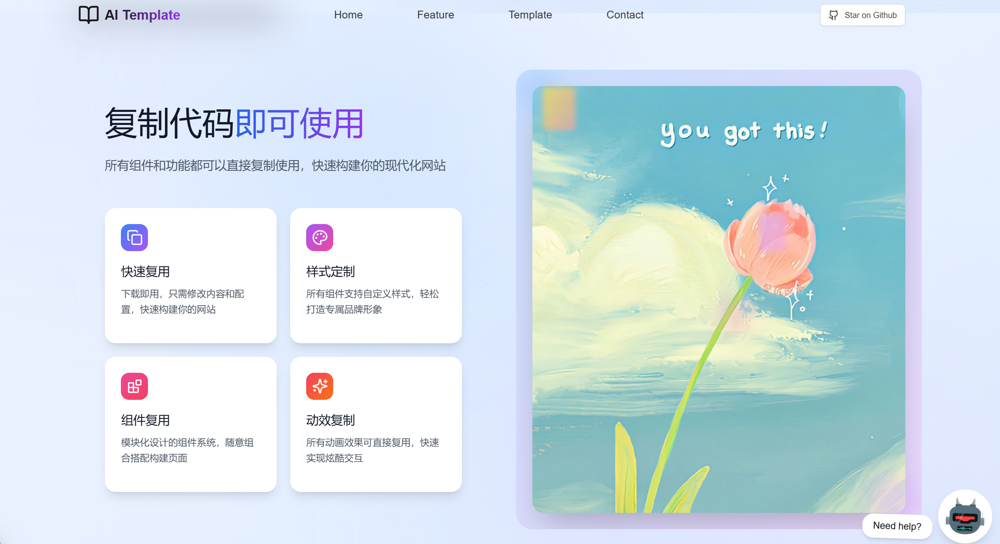
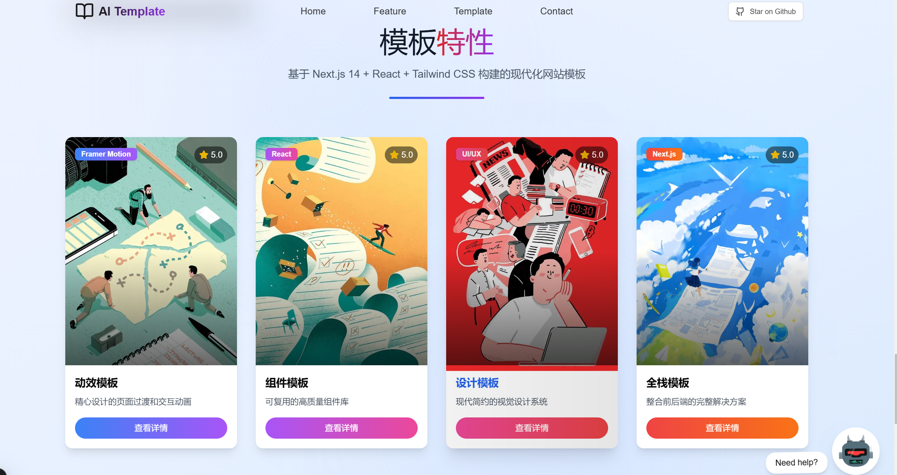
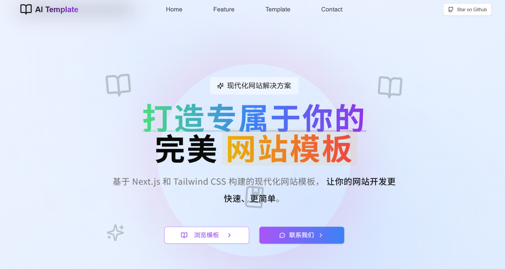

# Modern Website Template

🎨 A modern, responsive website template built with Next.js 14, Tailwind CSS, and Framer Motion.

## 📸 Preview

### Template
<p align="center">
  
</p>

### Feature
<p align="center">
  
</p>

### Hero
<div align="center">
  <div style="display: flex; justify-content: center; gap: 20px;">
    
  </div>
</div>

## ✨ Features

- 🚀 Built with Next.js 14 and TypeScript
- 💅 Styled with Tailwind CSS
- 🎭 Smooth animations with Framer Motion
- 📱 Fully responsive design
- 🌙 Dark mode support
- 🎯 SEO optimized
- ⚡ Fast performance
- 🧩 Modular component architecture

## 🛠 Component Showcase

This modern website template is perfect for:
- 🏢 Corporate Brand Websites
- 🛍️ Product Marketing
- 💼 Professional Services
- 📱 App Landing Pages
- 🎯 Marketing Campaigns
- 🌐 Digital Portfolios
- 🚀 SaaS Platforms

### Template
<p align="center">
  
</p>

### Links：https://github.com/Kelin0x/LiteraSea

<p align="center">
  
</p>

## 🛠️ Tech Stack

- [Next.js 14](https://nextjs.org/)
- [TypeScript](https://www.typescriptlang.org/)
- [Tailwind CSS](https://tailwindcss.com/)
- [Framer Motion](https://www.framer.com/motion/)
- [Lucide Icons](https://lucide.dev/)
- [Shadcn/ui](https://ui.shadcn.com/)

## 🚀 Getting Started

1. Clone the repository:
```bash
git clone https://github.com/Kelin0x/AI_Template_LandingPage.git
```

2. Install dependencies:
```bash
npm install

```

3. Run the development server:
```bash
npm run dev
# or
yarn dev
# or
pnpm dev
```

4. Open [http://localhost:3000](http://localhost:3000) with your browser to see the result.

## 📁 Project Structure

```
├── app/                  # Next.js app directory
├── components/          # React components
│   ├── ui/             # UI components
│   └── landingpage/    # Landing page components
├── lib/                # Utility functions
├── styles/            # Global styles
└── public/            # Static assets
```

## 🎨 Customization

1. Colors and Typography:
   - Edit `tailwind.config.js` to customize your color palette and typography
   - Modify `globals.css` for global styles

2. Components:
   - All components are modular and can be easily customized
   - Find components in the `components/` directory

## 📝 License

This project is licensed under the MIT License - see the [LICENSE](LICENSE) file for details.

## 🤝 Contributing

Contributions, issues, and feature requests are welcome! Feel free to check [issues page](https://github.com/yourusername/modern-website-template/issues).

## 💖 Support

Give a ⭐️ if this project helped you!


---

Made with 💖 by [Kelin0x](https://github.com/Kelin0x)